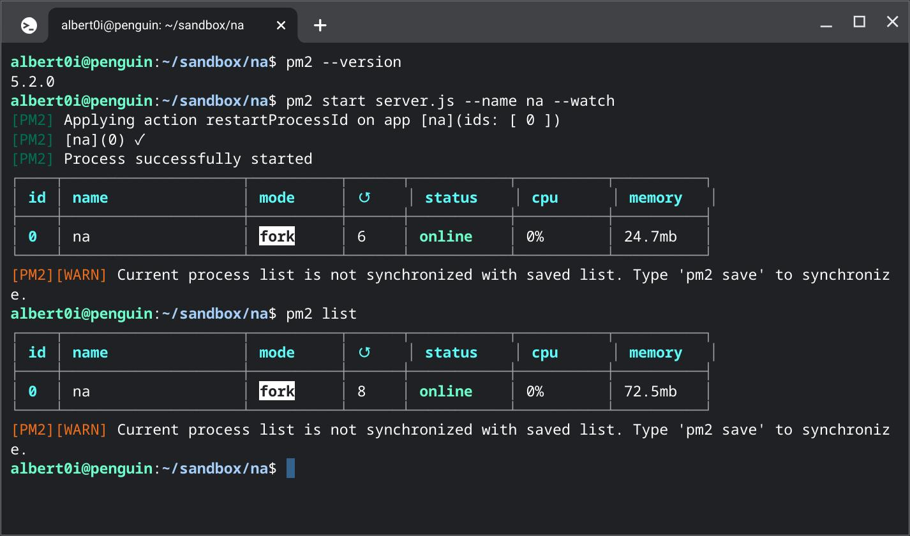

# Node-tify TA project <br /> ─ [“Old soldiers never die--they just fade away.”](https://iowaculture.gov/history/education/educator-resources/primary-source-sets/cold-war/old-soldiers-never-die-address-gen)

## Forward
I have a story, i.e. **TA**, but I won't tell you, not because it is insignificant, just because I don't want to... Being stagnated in a pond for over two decades, I became so accustomed to the placid posture of it. The ways of gearing things up, the steps to do things right which I was so acquaintance. They just deeply implanted in my brain unconsciously. 

Two years ago, I came across the other *way* when I was finding means to *modernize* my artefacts. All my works proved to be in vain, as you may know, changing the clothes of a dying man doesn't prevent him from cessation, the only effect was to put a new shroud on an old carcase... At the first sight of the *way*, I was startled and dropped to faint immediately at it's velocity and delicacy... With tremendous mental exertion, I managed to finish **TA2**.


While sitting miserably doesn't change anything. I decided to renounce my old ways, my old days and search for new dream, new deed, of course, with new way. 


## I. Back to [HTTP](https://developer.mozilla.org/en-US/docs/Web/HTTP), Back to Normal
[ASP.NET Web Forms](https://docs.microsoft.com/en-us/aspnet/web-forms/) employs a simplified model to facilitate creation of web pages. The discussion of pros and cons is voluminous. The good things is it alleviates the burden of learning the underlay HTTP protocol, which gives novices a quick start. The bad things is, by default, you can not use HTTP verbs other than GET and POST<sup>[[2]](https://stackoverflow.com/questions/10906411/asp-net-web-api-put-delete-verbs-not-allowed-iis-8)</sup>and no intrinsic [RESTFul](https://en.wikipedia.org/wiki/Representational_state_transfer) URI support. 

HTTP verbs such as PUT and DELETE are important when [AJAX](https://www.w3schools.com/js/js_ajax_intro.asp) comes into play, RESTful URI are important when implementing API for front-end frameworks. While some strives to survive Web Forms in the Age of .NET 5/6+<sup>[[1]](https://blog.inedo.com/dotnet/net5-web-forms)</sup>, others seek ways to migrate or quit. 

When comparing .NET Core with NodeJS, my scale is not on any language or environment heritage. While .NET Core is still under heavy development, NodeJS attains a more mature and fast-growing society, it is lightweight and more flexible, fits for both Bare-metal and Docker deployment. As a bonus, NodeJS integrates seamlessly with MongoDB and Redis, some state-of-the-art packages can not do without. 


## II. The Brothers [NodeJS](https://nodejs.org/en/)
server.js
```javascript
const express = require('express')
const app = express()
. . . 
app.use('/task', taskRoute)
app.use('/user', userRoute)
. . . 
app.listen(port, () => {
    console.log(`Application started on port ${port}`)
})
```

[express](https://www.npmjs.com/package/express)
> Express is a minimal and flexible Node.js web application framework that provides a robust set of features for web and mobile applications.

[MongoDB](https://www.mongodb.com/)
> MongoDB is a source-available cross-platform document-oriented database program. Classified as a NoSQL database program, MongoDB uses JSON-like documents with optional schemas. 

[Redis](https://redis.io/)
> Redis (Remote Dictionary Server) is an in-memory data structure store, used as a distributed, in-memory key–value database, cache and message broker, with optional durability. 


## III. The importance of being Model
[](https://rin.tw/naomis/)

[Mongoose](https://mongoosejs.com/)
> Mongoose provides a straight-forward, schema-based solution to model your application data. It includes built-in type casting, validation, query building, business logic hooks and more, out of the box.


## IV. [EJS](https://ejs.co/)
>EJS is a simple templating language that lets you generate HTML markup with plain JavaScript. No religiousness about how to organize things. No reinvention of iteration and control-flow. It's just plain JavaScript.


## V. [PM2](https://pm2.keymetrics.io/)
> PM2 is a daemon process manager that will help you manage and keep your application online. Getting started with PM2 is straightforward, it is offered as a simple and intuitive CLI, installable via NPM.


### Local server
Start and daemonize an app, with a name and keeping watching on source changes (default). 
```bash
    pm2 start server.js --name na --watch
```
Stop a process
```bash
    pm2 stop na
```
Restart a process
```bash
    pm2 restart na
```
List all processes
```bash
pm2 list
```

Stop and delete a process from pm2 process list
```bash
    pm2 delete na
```

### Remote server
Setup
```bash
    pm2 deploy production setup
```
Edit ecosystem.config.js
```javascript 
module.exports = {
    apps : [{
      name: "na",
      script: 'server.js',
      instances: 4,
      exec_mode: "cluster",
      watch: '.',
      env_production: {
        NODE_ENV: "production"
      }
    }],
    deploy : {
      production : {
        key: "../ssh-key-2022-05-09(2).pem",
        user : 'ubuntu',
        host : '140.238.40.147',
        ssh_options: "StrictHostKeyChecking=no",
        ref  : 'origin/main',
        repo : 'https://github.com/Albert0i/na.git',
        path : '/home/ubuntu/na',
        'pre-setup' : '',
        'post-setup' : '', 
        'pre-deploy-local': '',
        'pre-deploy' : '', 
        'post-deploy' : 'npm install && pm2 reload ecosystem.config.js --env production '
      }
    }
  };
```
Deploy 
```bash            
    pm2 deploy production
```
Update 
```bash  
    pm2 deploy production update 
    pm2 deploy production update --force
```


list previous deploy commits
```bash
    pm2 deploy production list
```
execute the given <cmd>  
```bash  
    pm2 deploy production exec pm2 list
```
Help
```bash
    pm2 deploy help
```


## VI. Summary 


[Live Site](http://140.238.40.147:3000/task) 


## VII. Reference
1. [Web Forms in the Age of .NET 5/6+: Planning for the Long Term](https://blog.inedo.com/dotnet/net5-web-forms)
2. [ASP.NET Web API - PUT & DELETE Verbs Not Allowed - IIS 8](https://stackoverflow.com/questions/10906411/asp-net-web-api-put-delete-verbs-not-allowed-iis-8)
3. [Markdown Cheat Sheet](https://www.markdownguide.org/cheat-sheet/)


## VIII. Appendix

.env file
```
# Server port 
PORT = 3000

# MongoDB 
MONGODB_URI = "mongodb+srv://your_mongodb_server_url"

# Redis
REDIS_URI = "redis://your_redis_server_url"
```


## EOF (2022/08/16)