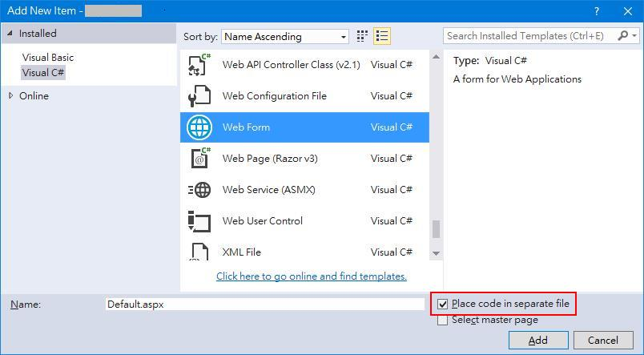

# Node-tify TA project <br /> ─ [“Old soldiers never die--they just fade away.”](https://iowaculture.gov/history/education/educator-resources/primary-source-sets/cold-war/old-soldiers-never-die-address-gen)

## Forward
I have a story, i.e. **TA**, but I won't tell you, not because it is insignificant, just because I don't want to... Being stagnated in a pond for over two decades, I became so accustomed to the placid posture of it. The ways of gearing things up, the steps to do things right which I was so acquaintance. They just deeply implanted in my brain unconsciously. 

Two years ago, I came across the other *way* when I was finding means to *modernize* my artefacts. All my works proved to be in vain, as you may know, changing the clothes of a dying man doesn't prevent him from cessation, the only effect was to put a new shroud on an old carcase... At the first sight of the *way*, I was startled and dropped to faint immediately at it's velocity and delicacy... With tremendous mental exertion, I managed to finish **TA2**.


While sitting miserably doesn't change anything. I decided to renounce my old ways, my old days and search for new dream, new deed, of course, with new way. 


## I. [HTTP](https://developer.mozilla.org/en-US/docs/Web/HTTP) - Back to Normal
[ASP.NET Web Forms](https://docs.microsoft.com/en-us/aspnet/web-forms/) employs a simplified model to facilitate creation of web pages. The discussion of pros and cons is voluminous. The good things is it alleviates the burden of learning the underlay HTTP protocol, which gives novices a quick start. The bad things is, by default, you can not use HTTP verbs other than GET and POST<sup>[[2]](https://stackoverflow.com/questions/10906411/asp-net-web-api-put-delete-verbs-not-allowed-iis-8)</sup>and no intrinsic [RESTFul](https://en.wikipedia.org/wiki/Representational_state_transfer) URI support. 

HTTP verbs such as PUT and DELETE are important when [AJAX](https://www.w3schools.com/js/js_ajax_intro.asp) comes into play, RESTful URI are important when implementing API for front-end frameworks. While some strives to survive Web Forms in the Age of .NET 5/6+<sup>[[1]](https://blog.inedo.com/dotnet/net5-web-forms)</sup>, others seek ways to migrate or quit. 

When comparing .NET Core with NodeJS, my scale is not on any language or environment heritage. While .NET Core is still under heavy development, NodeJS attains a more mature and fast-growing society, it is lightweight and more flexible, fits for both Bare-metal and Docker deployment. As a bonus, NodeJS integrates seamlessly with MongoDB and Redis, some state-of-the-art packages can not do without. 


## II. [npm](https://www.npmjs.com/) - The Brothers [NodeJS](https://nodejs.org/en/)

```javascript
    npm init -y 
    npm install express
    npm install nodemon --save-dev
    npm install pm2 -g

    npm help install
```

### [express](https://www.npmjs.com/package/express)
> Express is a minimal and flexible Node.js web application framework that provides a robust set of features for web and mobile applications.

server.js
```javascript
const express = require('express')
const app = express()
. . . 
app.use('/task', taskRoute)
app.use('/user', userRoute)
. . . 
app.listen(port, () => {
    console.log(`Application started on port ${port}`)
})
```

### [MongoDB](https://www.mongodb.com/)
> MongoDB is a source-available cross-platform document-oriented database program. Classified as a NoSQL database program, MongoDB uses JSON-like documents with optional schemas. 

The flexibility of MongoDB as a schemaless database is one of its strengths. If we would like to be more restrictive and have a really fixed schema for the collection we need to add the `additionalProperties: false` parameter in the createCollection command.

```javascript
db.createCollection( "people" , {
   validator: {
     $jsonSchema: 
	 {
        bsonType: "object",
        additionalProperties: false,
		required: ["name","age"],
        properties: {
           _id : {
              bsonType: "objectId" },
           name: {
              bsonType: "string",
              description: "required and must be a string" },
           age: {
              bsonType: "int",
              minimum: 0,
              maximum: 100,
              description: "required and must be in the range 0-100" }
		}
	}
}})
```
In this case, we don’t have flexibility, and that is the main benefit of having a NoSQL database like MongoDB. It’s up to you to use it or not. It depends on the nature and goals of your application. I wouldn’t recommend it in most cases.

### [Redis](https://redis.io/)
> Redis (Remote Dictionary Server) is an in-memory data structure store, used as a distributed, in-memory key–value database, cache and message broker, with optional durability. 

The default server-side session storage, MemoryStore, is purposely not designed for a production environment. It will leak memory under most conditions, does not scale past a single process, and is meant for debugging and developing.

```javascript
const session = require("express-session");
const Redis = require("ioredis");
. . . 
// Local session
let sess = {
    secret: 'keyboard cat',
    resave: false,
    saveUninitialized: true, 
    cookie: { 
      maxAge: 30 * 60 * 1000   // in milliseconds
    }
}
// if Redis is defined, it should be Redis session
if (process.env.REDIS_URI)
{
    let RedisStore = require("connect-redis")(session);
    let RedisClient = new Redis(process.env.REDIS_URI);
    sess.store = new RedisStore({ client: RedisClient })
    RedisClient.on('connect', () => {
        console.log('Connected to Redis Server.')
        RedisClient.set('hello', format(new Date(), 'yyyy-MM-dd hh:mm:ss'));
    })    
}
app.use(session(sess))
```


## III. [Mongoose](https://mongoosejs.com/) - The importance of being Model
[](https://rin.tw/naomis/)

> Mongoose provides a straight-forward, schema-based solution to model your application data. It includes built-in type casting, validation, query building, business logic hooks and more, out of the box.

task.js
```javascript
 const mongoose = require('mongoose');
 const Schema = mongoose.Schema;
 
 const TaskSchema = new Schema({     
     taname: {
         type: String,
         required: true, 
         index: true, 
         lowercase: true
     },
     tatype: {
         type: String,
         required: true
     },
     tadate: {
         type: Number,
         required: true
     },
     taappnum: String,
     tafamrep: String,
     taremark: String
    },
    { 
        timestamps: true
    });
 
 module.exports = mongoose.model('Task', TaskSchema);
```

## IV. [EJS](https://ejs.co/) - A Taste of the Past
>EJS is a simple templating language that lets you generate HTML markup with plain JavaScript. 7No religiousness about how to organize things. No reinvention of iteration and control-flow. It's just plain JavaScript.

One of the best feature of ASP.NET Web Forms is to enable user to place code in separate file, i.e. **code behind**. Source code and HTML code are cleanly separated. 


While legacy ASP writes source code and HTML code side-by-side, i.e. **code beside**. Source code and HTML code can mess up easily. 
 

index.ejs
```javascript
. . . 
<body>
    <%- include('header.ejs'); %>

    <%- include('create_edit.ejs'); %>
    <hr>
    <h3><a href="/task">所有工作</a></h3>
    <% if (locals.tasks.length > 0 ) { %>  
        <table border="1">
            <thead>
                <tr>
                    <th>工作類型</th>
                    <th>工作日期</th>
                    <th>申請表編號</th>
                    <th>家團代表</th>
                    <th>工作備註</th>
                    <th></th>
                    <th></th>
                </tr>
            </thead>
            <tdody><% locals.tasks.forEach( t => { %>
                    <tr>
                        <td><%= t.tatype %></td>
                        <td><%= t.tadate %></td>
                        <td><%= t.taappnum %></td>
                        <td><%= t.tafamrep %></td>
                        <td><%= t.taremark %></td>
                        <td>                            
                            <form action="/task?id=<%= t._id %>" method="GET">
                                <input type="hidden" name="id" value="<%= t._id %>">
                                <button type="submit">Edit</button>
                            </form>
                        </td>
                        <td>
                            <form action="/task/delete/<%= t._id %>?_method=DELETE" method="POST">
                                <button type="submit" onclick="return confirm('Are you sure?')">Delete
                                </button>
                            </form>
                        </td>
                    </tr>
                <% }) %>
            </tdody>
        </table>
    <% } else { %> 
        <p>沒有工作</p>
    <% } %>

    <%- include('footer.ejs'); %>
</body>
. . . 
```

## V. [PM2](https://pm2.keymetrics.io/) - Get Job Done!
> Since Node.js is built on top of the V8 JavaScript engine, it is single-threaded. So our app logic runs on one thread and hence doesn’t fully utilize the available system resources.
>
> This might not be a serious problem for event-based I/O calls, because the event loop is efficient enough for most use cases at moderate traffic loads. The problem occurs when we have a computationally intensive logic that might potentially block the thread or when we have a sudden spike in our traffic that could potentially increase the latency of our services.

http.js
```javascript
const http = require('http')

const server = http.createServer((req, res) => {
  console.log(req.url)
    if (req.url === '/') {
      res.end('Home page')
    }
    else
    if (req.url === '/about') {
      console.time()
      for (let i=0; i< 1000; i++)
        for (let j=0; j < 1000; j++)
            console.log(`i=${i}, j=${j}`)
      console.timeEnd()
      res.end('About page')
    }
    else
    res.end('Error page')
})

server.listen(5000)
```
A request to ``/about`` will block subsequent ``/`` request. 

> PM2 internally uses the Node.js cluster module, but everything including the edge cases is handled for us and we don’t even have to touch our existing code to get this working.

### Local server


Start and daemonize an app, with a name and keeping watching on source changes (default). 
```bash
    pm2 start server.js --name na --watch
```
Stop a process
```bash
    pm2 stop na
```
Restart a process
```bash
    pm2 restart na
```
List all processes
```bash
pm2 list
```

Stop and delete a process from pm2 process list
```bash
    pm2 delete na
```

### Remote server


Setup
```bash
    pm2 deploy production setup
```
Edit [ecosystem.config.js](https://pm2.io/docs/runtime/guide/easy-deploy-with-ssh/)
```javascript 
module.exports = {
    apps : [{
      name: "na",
      script: 'server.js',
      instances: 4,
      exec_mode: "cluster",
      watch: '.',
      env_production: {
        NODE_ENV: "production"
      }
    }],
    deploy : {
      production : {
        key: "../ssh-key-2022-05-09(2).pem",
        user : 'ubuntu',
        host : '140.238.40.147',
        ssh_options: "StrictHostKeyChecking=no",
        ref  : 'origin/main',
        repo : 'https://github.com/Albert0i/na.git',
        path : '/home/ubuntu/na',
        'pre-setup' : '',
        'post-setup' : '', 
        'pre-deploy-local': '',
        'pre-deploy' : '', 
        'post-deploy' : 'npm install && pm2 reload ecosystem.config.js --env production '
      }
    }
  };
```
1. ``exec_mode: "cluster"`` tells PM2 to use the Node.js cluster module to execute the code.

2. ``instances:0`` when this is set to 0, PM2 will automatically spawn a number of child processes that are equal to the available number of cores. Respawning on termination is handled out of the box. <u>It is important to note that, we could spawn more child processes than the number of CPU cores available, but that wouldn’t be a good idea, because it would create a scheduling overhead and in that way, we might end up doing worse than better.</u>

3. ``"post-deploy": "npm install && pm2 reload ecosystem.config.js -env production"`` the key thing to note here is pm2 reload which will make a zero-downtime deployment by adopting a rolling deployment approach where the instances are stoped and launched with the latest changes one after the other.

4. It is also interesting to note that the config can have multiple Node applications within the app array (think of a **microservices** scenario).

Deploy 
```bash            
    pm2 deploy production
```
Update 
```bash  
    pm2 deploy production update 
    pm2 deploy production update --force
```


List previous deploy commits
```bash
    pm2 deploy production list
```
Execute the given command  
```bash  
    pm2 deploy production exec pm2 list
```


## VI. Summary 
> PM2 is a daemon process manager that will help you manage and keep your application online. Getting started with PM2 is straightforward, it is offered as a simple and intuitive CLI, installable via NPM.

Previously, we've talked about how to setup [Docker swarm on Oracle Cloud (Free Tier)](https://github.com/Albert0i/node-docker/blob/main/swarm.md) and [deploy](https://github.com/Albert0i/node-docker/blob/main/NFUD.md) a NodeJS app on it. As a lightweight alternative, PM2 can be used to launch your app or deploy your code to remote host.   


### Links online

&emsp;[http](http://140.238.40.147/task)

&emsp;[https](https://140.238.40.147/task)


## VII. Reference
1. [Web Forms in the Age of .NET 5/6+: Planning for the Long Term](https://blog.inedo.com/dotnet/net5-web-forms)
2. [MVC vs Web Forms](https://riptutorial.com/asp-net-mvc/topic/8584/mvc-vs-web-forms)
3. [ASP.NET Web API - PUT & DELETE Verbs Not Allowed - IIS 8](https://stackoverflow.com/questions/10906411/asp-net-web-api-put-delete-verbs-not-allowed-iis-8)
4. [MongoDB Data Validator: How to Use the JSON Schema Validator](https://www.percona.com/blog/2018/08/16/mongodb-how-to-use-json-schema-validator/)
5. [Schema Validationicons](https://docs.mongodb.com/manual/core/schema-validation/)
6. [Scaling Node.js Applications With PM2 Clusters](https://medium.com/geekculture/scaling-node-js-applicationswith-pm2-clusters-c216c4468d66)
7. [PM2 one click, multiple servers deploy and publish Node.js project at the same time!](https://programmer.group/61a05b4430e7f.html)   
8. [PM2 | Listening on port 80 w/o root](https://pm2.keymetrics.io/docs/usage/specifics/#listening-on-port-80-w-o-root)
9. [Enabling HTTPS on express.js](https://stackoverflow.com/questions/11744975/enabling-https-on-express-js)
10. [Limiting Node.js API calls with express-rate-limit](https://dev.to/brunohgv/limiting-node-js-api-calls-with-express-rate-limit-11kl)
11. [Node.js vs .NET Core: What to Choose in 2022](https://intelvision.pro/blog/node-js-vs-net-core-what-to-choose-in-2022/)
12. [Web server implementations in ASP.NET Core](https://docs.microsoft.com/en-us/aspnet/core/fundamentals/servers/?view=aspnetcore-6.0&tabs=windows)
13. [Markdown Guide | Basic Syntax](https://www.markdownguide.org/basic-syntax/)


## VIII. Appendix

.env file
```
# Server port 
PORT = 3000

# Server port (https)
PORT_HTTPS = 443

# Server limit
MAX_REQUEST_PER_MINUTE = 100

# MongoDB 
MONGODB_URI = "mongodb+srv://your_mongodb_server_url"

# Redis
REDIS_URI = "redis://your_redis_server_url"
```

source tree:
```
.
├── README.md
├── controller
│   ├── taskController.js
│   └── userController.js
├── ecosystem.config.js
├── img
│   ├── Naomi_Party_in_TAIPEI.jpg
│   ├── asp-era-1.JPG
│   ├── code_behind_beside.JPG
│   ├── npm.JPG
│   ├── pm2_deploy_help.JPG
│   ├── pm2_deploy_production_update.JPG
│   ├── pm2_examples.JPG
│   ├── pm2_list.JPG
│   └── ta2.JPG
├── middleware
│   └── auth.js
├── model
│   ├── Option.js
│   ├── Task.js
│   └── User.js
├── package-lock.json
├── package.json
├── public
│   ├── 404.png
│   └── favicon.ico
├── routes
│   ├── taskRoute.js
│   └── userRoute.js
├── server.js
└── views
    ├── 404.ejs
    ├── task
    │   ├── create_edit.ejs
    │   ├── footer.ejs
    │   ├── header.ejs
    │   ├── index.ejs
    │   └── options.ejs
    └── user
        ├── login.ejs
        └── signup.ejs
```

## EOF (2022/08/23)